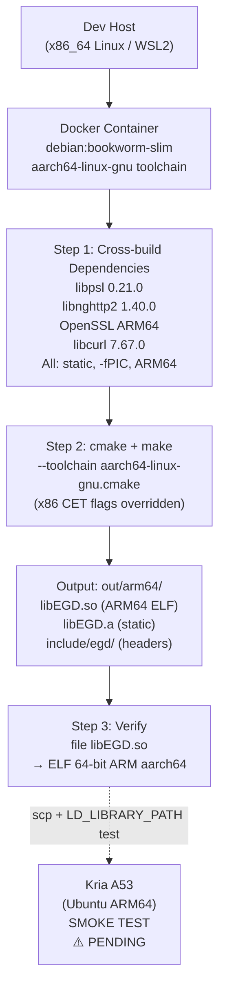
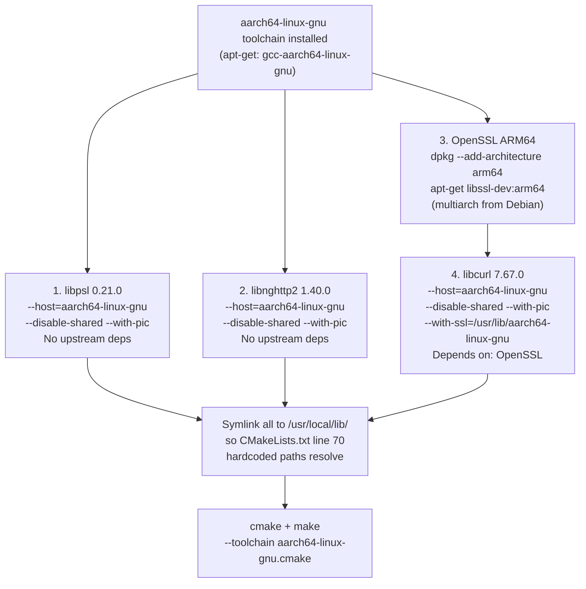

# M2-C — libEGD ko Kria ARM64 pe Cross-Compile karna

> **Citation Policy:** Is document mein har technical claim ke saath exact file path aur line number diya gaya hai.
> Koi bhi cheez jo "designed but not yet executed" hai, uske saath **[PENDING]** clearly likha hai.
> Sources sirf actual repo files hain — koi assumption nahi, koi invention nahi.

**Version:** M2-C (Milestone 2, Task C)  
**Primary Sources:**
- `docs/milestone2/M2-C_cross_compile.md` — designed pipeline (main spec)
- `libEGD-master/CMakeLists.txt` — actual build recipe
- `libEGD-master/Makefile` — Docker + arch config
- `libEGD-master/hack/docker/Dockerfile.builder` — dependency versions
- `EgdSend.c` — standalone fallback sender
- `docs/milestone2/M2-A_auroralink_findings.md`, `docs/milestone2/M2-B_libegd_findings.md` — context

---

## Section 0 — Pehle ek chhoti si kahani (phir seedha technical)

> **Ek Power Plant ki kahani:**
>
> Ek Power Plant mein ek powerful simulator hai jiska naam **RTDS** hai.
> Yeh simulator har millisecond mein electrical readings bhejta hai —
> voltage, current, switching commands — ek fiber optic cable ke zariye.
>
> Doosri taraf hai **Kria board** — ek chhota-sa computer jiske andar ek
> FPGA chip bhi hai aur ek ARM processor bhi. Is ARM processor pe Ubuntu
> Linux chal raha hai.
>
> Ab challenge yeh hai: RTDS se data aaya, FPGA ne pakda, lekin usse
> Ethernet pe bhejne ke liye jo software chahiye (**libEGD**) — woh
> sirf desktop Linux (x86_64) ke liye bana hai. ARM processor uss
> software ko seedha nahi samajhta.
>
> **M2-C ka kaam:** us software ko ARM64 ke liye compile karna —
> taaki Kria ke processor pe chal sake.

---

## Section 1 — Bada Picture: M2-C Kahan Fit Hota Hai

Poore project mein 4 sub-tasks hain (M2-A, M2-B, M2-C, M2-D).
M2-C unke beech mein ek critical stepping stone hai:

```
M2-A (Aurora)  ──┐
M2-B (libEGD)  ──┼──► M2-D (Bridge App Design)
M2-C (Build)   ──┘
```
*(Source: `docs/milestone2/README.md`, dependency graph)*

Har task ka ek line mein kaam:

| Task | Kya karta hai | Status |
|------|---------------|--------|
| **M2-A** | Aurora link kaise kaam karta hai — RTDS → fiber → FPGA → ARM interrupt → CPU word-pull (via `XLlFifo_RxGetWord()`) | Complete |
| **M2-B** | libEGD kaise kaam karta hai — UDP port 18246, 1400 byte payload cap, `JsonClient` vs `EgdClient` API | Complete |
| **M2-C** | libEGD ko ARM64 binary banao taaki Kria ke A53 processor pe chal sake | **In Progress** |
| **M2-D** | Bridge application design — Aurora ↔ Translation Layer ↔ EGD (M2-A + M2-B + M2-C ke baad) | Not Started |

### System ka dataflow diagram (full context):

```mermaid
flowchart LR
    rtds["RTDS Simulator\n(x86, fiber TX)"]
    aurora["Aurora 8b/10b IP\n(FPGA / PL side)"]
    fifo["AXI FIFO\n(PL→PS bridge)"]
    a53["Cortex-A53 Ubuntu\n(PS side — ARM64)"]
    bridge["Bridge App\n(to be built in M2-D)"]
    libegd["libEGD.so\n(ARM64 — M2-C ka output)"]
    ems["EMS / Remote Controller\n(UDP 18246)"]

    rtds -->|"fiber 2 Gbps Aurora"| aurora
    aurora -->|"AXI-Stream"| fifo
    fifo -->|"IRQ + word-pull"| a53
    a53 --> bridge
    bridge --> libegd
    libegd -->|"UDP EGD"| ems
```



**M2-C ka seedha contribution:** `libEGD.so (ARM64)` box — bina iske bridge app nahi chal sakti.

---

## Section 2 — Problem Statement: Simple Words Mein

### Kria board ke andar do alag "worlds" hain:

| World | Kya hai | Architecture |
|-------|---------|--------------|
| **PL (Programmable Logic)** | FPGA chip — Aurora link, FIFO hardware | Custom gates — no CPU |
| **PS (Processing System)** | Cortex-A53 CPU — Ubuntu Linux chal raha hai | **ARM64 (aarch64)** |

libEGD ek C++ library hai jo EGD protocol implement karti hai. Yeh GE ne banai thi apne desktop Linux servers ke liye.

Desktop servers run karte hain **x86_64 architecture** pe.  
Kria ka PS run karta hai **ARM64 architecture** pe.

**Problem:** x86_64 ke liye compile hua binary ARM64 pe nahi chalta.  
Dono ke machine instructions bilkul alag hain — jaise ek book Hindi mein likhi ho aur reader sirf Japanese padhta ho.

> **Analogy:** You write a letter in English (x86 code). The Kria only reads Urdu (ARM64 instructions). M2-C is the translation job.

**Solution options:**
1. Cross-compile — x86 dev box pe ARM64 binary banao
2. Native compile — seedha Kria board pe compile karo
3. Yocto/PetaLinux SDK — custom embedded OS ke liye (humara case nahi)

---

## Section 3 — libEGD ka Existing Build System: Kya Problem Hai?

Pehle samjho ki existing build system kya karta hai, phir samjho ki ARM64 ke liye kya todna padega.

### 3.1 Build system ke teeno main files:

**File 1: `libEGD-master/CMakeLists.txt`**

```cmake
# Line 17 — Release flags (x86 ONLY):
set(RELEASE_FLAGS "-s -D_FORTIFY_SOURCE=2 -pie -fpie -Wl,-z,relro,-z,now
                   -fstack-protector-all -fcf-protection=full -mshstk")
```
*(Source: `libEGD-master/CMakeLists.txt` line 17)*

> **`-fcf-protection=full -mshstk` — yeh do flags Intel CET (Control-flow Enforcement Technology) ke liye hain.**
> CET sirf Intel/AMD x86 processors mein hota hai.
> ARM64 pe compile karte time compiler yeh flag dekh ke **error dega — compile fail hoga.**
> Yeh sabse critical fix hai jo M2-C mein karna padega.

```cmake
# Line 70 — Static dependency paths (hardcoded):
set(STATIC_DEPS /usr/local/lib/libcurl.a
                /usr/local/lib/libnghttp2.a
                /usr/local/lib/libpsl.a)
```
*(Source: `libEGD-master/CMakeLists.txt` line 70)*

> **Matlab:** libEGD teen libraries ko statically link karta hai — aur unke paths hardcode hain.
> Jo `.a` files yahan expected hain, woh custom-built hain (standard `apt-get` wali nahi) —
> specifically `-fPIC` (Position Independent Code) flag ke saath compile ki gayi hain.
> Cross-compile ke liye in teeno ko bhi ARM64 ke liye build karna padega.

**File 2: `libEGD-master/Makefile`**

```makefile
# Line 57:
ALL_ARCH := amd64
```
*(Source: `libEGD-master/Makefile` line 57)*

> **Matlab:** Official Makefile mein ARM64 supported hi nahi hai. Sirf `amd64` likha hai.
> Hume nayi files banani padegi jo ARM64 support kare.

**File 3: `libEGD-master/hack/docker/Dockerfile.builder`**

```dockerfile
# Official build environment uses these exact versions:
ENV LIB_SSH_VERSION 1.9.0    # libssh2
ENV PSL_VERSION 0.21.0        # libpsl
ENV NGHTTP2_VERSION 1.40.0    # libnghttp2
ENV CURL_VERSION 7.67.0       # libcurl
```
*(Source: `libEGD-master/hack/docker/Dockerfile.builder` lines 61, 77, 78, 98)*

> Yeh sab source se build hote hain `--with-pic` flag ke saath.
> ARM64 ke liye bhi yahi versions chahiye, sirf cross-compiler ke saath.

### 3.2 Summary — kya todna padega:

| Problem | File | Line | Fix |
|---------|------|------|-----|
| x86-only CET flags | `CMakeLists.txt` | 17 | ARM64 equivalent flags se override |
| Hardcoded static dep paths | `CMakeLists.txt` | 70 | ARM64 libs build karo, symlink karo |
| Only amd64 in Makefile | `Makefile` | 57 | Nayi Dockerfile + script banao |
| No ARM64 toolchain in Docker | `Dockerfile.builder` | (entire) | Nayi `Dockerfile.builder.arm64` banao |

---

## Section 4 — Teen Approaches: Comparison Table (Honest)

Teen approaches possible thi. Teeno ki honest comparison:

| | **Option A** — Docker Cross-Compile | **Option B** — Native on Kria | **Option C** — Yocto/PetaLinux SDK |
|--|------|------|------|
| **Kya hai** | x86 dev box pe Docker run karo, andar ARM64 cross-compiler use karo | Seedha Kria pe SSH karo, wahan compile karo | Xilinx ke PetaLinux BSP ka cross-compiler use karo |
| **Board chahiye build ke liye?** | Nahi | Haan | Nahi |
| **Repeatability** | High — Docker image reproducible hai | Low — "it works on my board" | Medium |
| **CI/CD mein chalta hai?** | Haan | Nahi | Conditionally |
| **Complexity** | Medium-High — sab deps bhi cross-build karne padte hain | Low (initially) — `apt-get` se sab milta hai... par CMakeLists patch bhi karna padta hai | Yocto setup complex hai |
| **Kria Ubuntu ke saath** | Compatible | Best match | **N/A — Kria pe Ubuntu hai, Yocto nahi** |
| **Humara project ke liye** | **CHOSEN** | Plan-B fallback | Skip |

*(Analysis source: `docs/milestone2/M2-C_cross_compile.md` Section 2)*

**Option A kyun choose kiya:**
> "This avoids modifying GE's libEGD source and integrates cleanly with the existing project structure."
> — `docs/milestone2/M2-C_cross_compile.md` Section 2

Ek command se build hoti hai. Audit trail Docker image mein hai. Board available nahi ho tab bhi build chal sakti hai. Code review karte time reviewer apne laptop pe khud verify kar sakta hai.

---

## Section 5 — Chosen Approach: Docker Cross-Compile Pipeline (Deep Dive)

### 5.1 Big Picture Diagram



Dotted line `verify → kria` ka matlab: **yeh step abhi pending hai** — hardware access hone par karna hai.

---

### 5.2 Teen Nayi Files Jo Banani Padti Hain

*(Yeh teeno files abhi repo mein nahi hain — sirf `docs/milestone2/M2-C_cross_compile.md` mein describe ki gayi hain. Commit karna pending hai.)*

| File | Kaam | Status |
|------|------|--------|
| `cmake/toolchains/aarch64-linux-gnu.cmake` | CMake ko batata hai ki kaunsa compiler use karo, kaise hardening flags override karo | **[PENDING — designed, not committed]** |
| `libEGD-master/hack/docker/Dockerfile.builder.arm64` | Docker builder image jo ARM64 cross-compiler + sab deps build karta hai | **[PENDING — designed, not committed]** |
| `scripts/build_libegd_arm64.sh` | Single-command driver script | **[PENDING — designed, not committed]** |

*(Source: `docs/milestone2/M2-C_cross_compile.md` Section 3)*

---

### 5.3 CMake Toolchain File — Kya Karta Hai (3 Kaam)

Yeh file CMake ko batati hai ki hum x86 ke liye nahi, ARM64 ke liye build kar rahe hain.

**Kaam 1: Cross-compiler set karo**
```cmake
set(CMAKE_SYSTEM_NAME Linux)
set(CMAKE_SYSTEM_PROCESSOR aarch64)
set(CMAKE_C_COMPILER   aarch64-linux-gnu-gcc)
set(CMAKE_CXX_COMPILER aarch64-linux-gnu-g++)
```
> Matlab: `gcc` mat use karo (x86 wala), `aarch64-linux-gnu-gcc` use karo (ARM64 wala).

**Kaam 2: Library search path restrict karo**
```cmake
set(CMAKE_FIND_ROOT_PATH /usr/aarch64-linux-gnu)
set(CMAKE_FIND_ROOT_PATH_MODE_LIBRARY ONLY)
set(CMAKE_FIND_ROOT_PATH_MODE_INCLUDE ONLY)
```
> Matlab: `find_library()` sirf ARM64 sysroot mein dhoonde, x86 system libraries mein nahi.
> Warna cross-compile ke dauran galat (x86) libraries link ho sakti hain — silent bug.

**Kaam 3: Intel CET flags ko override karo (CRITICAL FIX)**

Problem (existing `CMakeLists.txt` line 17):
```cmake
# x86-ONLY flags — ARM64 pe compile fail karega:
-fcf-protection=full -mshstk
```

Fix (toolchain file mein):
```cmake
set(ARM64_HARDENING
    "-D_FORTIFY_SOURCE=2 -fpie -Wl,-z,relro,-z,now
     -fstack-protector-all -mbranch-protection=standard")
set(CMAKE_CXX_FLAGS_RELEASE "-O2 -s ${ARM64_HARDENING}" CACHE STRING "" FORCE)
set(CMAKE_C_FLAGS_RELEASE   "-O2 -s ${ARM64_HARDENING}" CACHE STRING "" FORCE)
```
*(Source: `docs/milestone2/M2-C_cross_compile.md` Section 4)*

> **`-fcf-protection=full -mshstk` kya tha?**
> Intel CET = Control-flow Enforcement Technology. Yeh Intel CPUs mein hardware-level
> protection hai jo return-oriented programming (ROP) attacks rokta hai.
> ARM64 mein yeh feature exist nahi karta is naam se.
>
> **`-mbranch-protection=standard` kya hai?**
> ARM64 ka equivalent — PAC (Pointer Authentication Codes) + BTI (Branch Target Identification).
> ARMv8.3 se available hai. Debian bookworm ka GCC 12 yeh support karta hai.
> Security level equivalent hai — sirf architecture alag hai.
>
> **GCC version requirement:** `-mbranch-protection=standard` ke liye GCC 9+ chahiye.
> Humara Docker base image Debian bookworm use karta hai jisme GCC 12 hai. Safe hai.

---

### 5.4 Dependency Build Order — Dockerfile.builder.arm64 ke Andar

libEGD ki dependencies ka ek chain hai. Har dep ko ARM64 + static (`--disable-shared`) + position-independent (`--with-pic`) compile karna padega.



**Symlink kyun zaruri hai:**

`CMakeLists.txt` line 70 yeh paths expect karta hai:
```cmake
/usr/local/lib/libcurl.a
/usr/local/lib/libnghttp2.a
/usr/local/lib/libpsl.a
```

Hum ARM64 libs ko `/usr/local/aarch64-linux-gnu/lib/` mein install karte hain.
Phir symlink banate hain:
```bash
ln -s /usr/local/aarch64-linux-gnu/lib/libcurl.a    /usr/local/lib/libcurl.a
ln -s /usr/local/aarch64-linux-gnu/lib/libnghttp2.a /usr/local/lib/libnghttp2.a
ln -s /usr/local/aarch64-linux-gnu/lib/libpsl.a     /usr/local/lib/libpsl.a
```
> Is trick se `CMakeLists.txt` mein koi change nahi karna padta — GE ka source code untouched rehta hai.

*(Source: `docs/milestone2/M2-C_cross_compile.md` Section 5)*

---

### 5.5 Single Command — Kaise Use Karte Hain

Build karne ke liye (protocol_translator root se):
```bash
./scripts/build_libegd_arm64.sh
```

Yeh internally yeh steps karta hai:
1. `libegd-arm64:builder` Docker image build karta hai (cross-compiler + sab deps)
2. libEGD source ko container mein read-only mount karta hai
3. `cmake --toolchain ... + make` run karta hai container ke andar
4. `out/arm64/` mein artifacts copy karta hai
5. `file libEGD.so` se verify karta hai ki ARM64 ELF hai

Clean karne ke liye:
```bash
./scripts/build_libegd_arm64.sh --clean
```

*(Source: `docs/milestone2/M2-C_cross_compile.md` Section 6)*

---

### 5.6 Expected Output

Build successful hone ke baad:
```
out/arm64/
├── lib/
│   ├── libEGD.so        ← shared library (ARM64 ELF)
│   └── libEGD.a         ← static library (ARM64)
└── include/
    └── egd/
        ├── client/
        │   ├── egd_client.h
        │   ├── json_client.h
        │   └── ...
        └── util/
            └── egd_spec.h
```

`file libEGD.so` ka expected output:
```
libEGD.so: ELF 64-bit LSB shared object, ARM aarch64, version 1 (SYSV), dynamically linked
```

*(Source: `docs/milestone2/M2-C_cross_compile.md` Section 7)*

> Agar output mein `x86-64` dikhta hai to cross-compile kaam nahi kiya — toolchain file
> sahi se pick nahi hui. Pehle `file` output check karo, fir board pe copy karo.

---

## Section 6 — Smoke Test on Kria A53 — ⚠️ PENDING

**Yeh test abhi nahi hua hai.** Board access abhi available nahi hai.

*(Source: `docs/milestone2/M2-C_cross_compile.md` Section 9 heading "Pending Hardware Access", Section 10 row 1)*

### Plan — Jab Board Available Ho:

**Step 1: Artifacts Kria pe copy karo**
```bash
# Dev machine se:
scp out/arm64/lib/libEGD.so          ubuntu@<kria-ip>:/tmp/
scp out/arm64/bin/JsonPublishCPP     ubuntu@<kria-ip>:/tmp/
```

**Step 2: Board pe SSH karke run karo**
```bash
ssh ubuntu@<kria-ip>
chmod +x /tmp/JsonPublishCPP
LD_LIBRARY_PATH=/tmp /tmp/JsonPublishCPP
```

**Step 3: Output dekho**

| Output | Matlab | Status |
|--------|--------|--------|
| `Error reading config(-1): NETWORK_ERROR` | Binary chal gaya, EGD config server nahi mila — **PASS** (smoke test ke liye kaafi hai) | Acceptable |
| `SIGILL: Illegal instruction` | Binary ka instruction set Kria se match nahi kiya — **FAIL** — toolchain ya ABI mismatch | Investigate |
| `Segmentation fault` | Library load hui but libcurl mismatch — **FAIL** | Investigate |
| `error while loading shared libraries` | glibc version mismatch — **FAIL** | Check with `ldd` |

> **SIGILL explanation:** Agar binary ARM64 ke liye compile hua lekin kisi purane ARMv7 instruction set ke assumptions ke saath (ya agar Kria ka Ubuntu kernel kisi constraint mein hai), to processor ek instruction dekh ke "yeh mujhe nahi pata" bol deta hai — yahi SIGILL hai. `file` output cross-check karo.

*(Source: `docs/milestone2/M2-C_cross_compile.md` Section 9)*

---

## Section 7 — Fallback Plans (Agar Docker Pipeline Mein Blocker Aaye)

Honest hai ki Docker cross-compile mein blockers aa sakte hain (dep path issues, multiarch quirks). Isliye do fallback plans ready hain:

### Fallback 1 — Option B: Native Compile on Kria

Seedha Kria ke A53 pe compile karo. Board available hona chahiye.

```bash
# Step 1: Kria pe SSH karo
ssh ubuntu@<kria-ip>

# Step 2: Build tools install karo
sudo apt-get update
sudo apt-get install -y cmake g++ libssl-dev zlib1g-dev \
    libcurl4-openssl-dev git build-essential

# Step 3: libEGD-master copy karo (dev machine se)
# (dev machine par chalao:)
scp -r libEGD-master/ ubuntu@<kria-ip>:~/

# Step 4: Build karo
cd ~/libEGD-master
mkdir build && cd build
cmake ..
make -j4

# Step 5: Verify
file libEGD.so   # should say: ELF 64-bit LSB shared object, ARM aarch64
```

*(Source: `docs/milestone2/M2-C_cross_compile.md` Section 5)*

> **Caveat — yeh ek critical problem hai:**
> `cmake ..` ke time `STATIC_DEPS` (line 70) `/usr/local/lib/libcurl.a` expect karta hai.
> `apt-get install libcurl4-openssl-dev` se jo milta hai woh `/usr/lib/aarch64-linux-gnu/libcurl.so` hai —
> yani **shared library hai, static nahi**. Build fail hogi.
>
> Solutions:
> 1. Kria pe bhi libcurl + libpsl + nghttp2 source se build karo (`Dockerfile.builder` ke steps manually follow karke)
> 2. Ya `CMakeLists.txt` line 70 patch karo — `STATIC_DEPS` ko system `.so` paths pe point karo
> 3. Ya `EgdSend.c` fallback use karo (below)

---

### Fallback 2 — Last Resort: `EgdSend.c` Standalone Test

`EgdSend.c` (repo root mein hai) ek standalone C file hai.
Isme **libEGD bilkul nahi use hoti** — sirf raw BSD sockets se EGD packets bhejta hai.

```bash
# Cross-compile (dev box pe):
aarch64-linux-gnu-gcc EgdSend.c -o EgdSend -lm

# Verify:
file EgdSend
# Expected: ELF 64-bit LSB executable, ARM aarch64

# Kria pe copy karo aur chalao:
scp EgdSend ubuntu@<kria-ip>:/tmp/
ssh ubuntu@<kria-ip>
/tmp/EgdSend 192.168.1.255 500 5
```

Expected output:
```
EGD Sender starting:
  Destination : 192.168.1.255:18246
  Interval    : 500 ms
  Count       : 5 messages
  ...
Sent 5 messages ...
```

*(Source: `EgdSend.c` lines 7-20)*

> `EgdSend.c` mein EGD ka pura wire format implement hai — PDU Type 13, port 18246,
> `Data_Production_Hdr` structure, `clock_nanosleep` ke saath drift-free timing.
> Agar yeh ARM64 pe chal jaata hai, to hum confirm kar sakte hain ki:
> - ARM64 binary sahi bana
> - EGD UDP packets network pe ja rahe hain
> - Timing mechanism chal raha hai
>
> Yeh partial proof hai — libEGD ki full functionality nahi, but meaningful evidence hai.

---

## Section 8 — Bridge App Integration (M3 ke liye Hook)

Jab M2-C complete hoga (libEGD ARM64 binary ready), bridge application (M2-D + M3) isko aise consume karegi:

```cmake
# Bridge app ka CMakeLists.txt mein (M3 mein likhna hai):
set(LIBEGD_ROOT "${CMAKE_SOURCE_DIR}/out/arm64")

add_library(EGD::shared SHARED IMPORTED)
set_target_properties(EGD::shared PROPERTIES
    IMPORTED_LOCATION "${LIBEGD_ROOT}/lib/libEGD.so"
    INTERFACE_INCLUDE_DIRECTORIES "${LIBEGD_ROOT}/include"
)

target_link_libraries(protocol_translator PRIVATE EGD::shared pthread ssl z)
```

Bridge app bhi same toolchain file se cross-compile hogi:

```bash
# Step 1: pehle libEGD banao
./scripts/build_libegd_arm64.sh

# Step 2: phir bridge app banao same toolchain se
cmake -S . -B build/arm64 \
    -DCMAKE_TOOLCHAIN_FILE=cmake/toolchains/aarch64-linux-gnu.cmake \
    -DCMAKE_BUILD_TYPE=Release
cmake --build build/arm64 --parallel
```

*(Source: `docs/milestone2/M2-C_cross_compile.md` Section 8)*

> Yeh design ek important principle follow karta hai: libEGD ek **pre-built imported target** hai —
> bridge app library ka source nahi dekhti, sirf `.so` + headers consume karti hai.
> Iska faayda: GE ke libEGD source ko kabhi modify nahi karna padega.

---

## Section 9 — Known Gaps aur Risks (Honest Table — Koi Bluff Nahi)

| # | Gap / Risk | Current Status | Resolution Path |
|---|------------|----------------|-----------------|
| **1** | **Smoke test on A53 hardware** — binary actually chalta hai ya nahi, yeh confirm nahi hua | **[PENDING]** — Kria board access abhi nahi | Board milte hi Section 6 ke steps chalao |
| **2** | **Teen implementation files repo mein nahi hain** — `Dockerfile.builder.arm64`, `aarch64-linux-gnu.cmake`, `build_libegd_arm64.sh` sirf design doc mein describe hain | **[PENDING]** — Commit karna baaki hai | M2-C implementation step mein commit karo |
| **3** | **libcurl `--with-ssl` path** — Debian multiarch layout assume karta hai `/usr/lib/aarch64-linux-gnu` — agar layout change hua to build fail | Risk | `pkg-config --libs openssl` use karke parameterize karo |
| **4** | **`-mbranch-protection=standard` requires GCC 9+** — Purane toolchain pe yeh flag unknown hoga | Mitigated | Debian bookworm GCC 12 use kar rahe hain — safe. Agar kabhi purana GCC use karo to yeh flag drop karo. |
| **5** | **EGD config XML fetch** — libEGD startup pe HTTP GET karta hai `http://<host>:7937/EGD?...` — bridge ko ControlST server ka IP chahiye hoga | Open (M2-D scope) | Config server address + retry policy M2-D mein specify karni hai |
| **6** | **`libssl1.1` dependency** — `hack/debian-deps.txt` mein sirf `libssl1.1` likha hai. Ubuntu 22.04 mein `libssl1.1` deprecated hai, `libssl3` available hai | Risk | Ubuntu 22.04 pe test karo, OpenSSL version compatibility check karo |

*(Sources: `docs/milestone2/M2-C_cross_compile.md` Section 10; `libEGD-master/hack/debian-deps.txt` line 1; `docs/milestone2/M2-B_libegd_findings.md` Section 9)*

---

## Section 10 — Summary: Ek Paragraph (Elevator Pitch — Client ke Liye)

**M2-C ka kaam:** libEGD — jo GE ki EGD-over-UDP C++ library hai — ko Kria board ke ARM64 processor ke liye compile karna. Yeh library x86 desktop Linux ke liye bani thi; isme do x86-only flags (`-fcf-protection=full -mshstk`, Intel CET) hardcode hain jo ARM64 pe compile fail karate hain, aur teen static dependencies (`libcurl 7.67.0`, `libnghttp2 1.40.0`, `libpsl 0.21.0`) hain jinhe bhi ARM64 ke liye source se build karna padta hai.

**Chosen approach:** Docker-based cross-compile pipeline — ek nayi `Dockerfile.builder.arm64` jo `aarch64-linux-gnu` toolchain install karta hai, sab dependencies ko statically cross-compile karta hai, phir ek CMake toolchain file (`aarch64-linux-gnu.cmake`) ke through libEGD build karta hai. Toolchain file Intel CET flags ko ARM64 ke equivalent (`-mbranch-protection=standard`, ARMv8.3 PAC+BTI) se override karti hai — security equivalence maintain rakhte hue GE ke source code mein koi change nahi karna padta. Output ek single command se milta hai: `./scripts/build_libegd_arm64.sh`.

**Current status:** Pipeline designed aur documented hai. Teen implementation files (Dockerfile, toolchain cmake, build script) commit hona baaki hain. A53 hardware pe smoke test pending hai — board access milne par chalayenge. Pass criteria simple hai: binary load ho, `SIGILL` na aaye. Fallback documented hai: native compile on Kria, ya standalone `EgdSend.c` jo bina libEGD ke raw EGD packets bhejta hai.

---

## Appendix — Quick Reference Cheatsheet

### Key Version Numbers (sab `Dockerfile.builder` se verified):

| Library | Version | Flag |
|---------|---------|------|
| libssh2 | 1.9.0 | `cmake` based |
| libpsl | 0.21.0 | `--with-pic --disable-shared` |
| libnghttp2 | 1.40.0 | `--with-pic --disable-shared` |
| libcurl | 7.67.0 | `--with-pic --disable-shared` |
| GCC (Docker) | 12 (Debian bookworm) | aarch64-linux-gnu |

### Key Ports / Protocol Facts (M2-B se — `docs/milestone2/M2-B_libegd_findings.md`):

| Parameter | Value | Source |
|-----------|-------|--------|
| EGD UDP port | 18246 | `egd_spec.h`, `EgdTest.h` |
| EGD config HTTP port | 7937 | `libEGD-master/README.md` |
| Max payload | 1400 bytes | `MAX_EGD_PAYLOAD` in `egd_spec.h` |
| PDU Type | 13 | `EGD_PDU_TYPE_DATA_PRODUCTION` |
| API recommendation | `JsonClient` | `docs/milestone2/M2-B_libegd_findings.md` Section 8 |

### Aurora Key Facts (M2-A se — `docs/milestone2/M2-A_auroralink_findings.md`):

| Parameter | Value | Source |
|-----------|-------|--------|
| IP variant | aurora_8b10b v11.1 | `design_1.hwh` in `top.xsa` |
| Lanes | 1 | same |
| Line rate | 2 Gbps | same |
| User clock | 50 MHz | same |
| RX path | IRQ → CPU word-pull via `XLlFifo_RxGetWord()` | `main.c`, `Axi_IO.c` |

---

*Document written by: AI agent*
*Sources verified against: actual repo files (paths and line numbers cited inline)*
*Last updated: M2-C planning phase — pending items clearly labelled*
